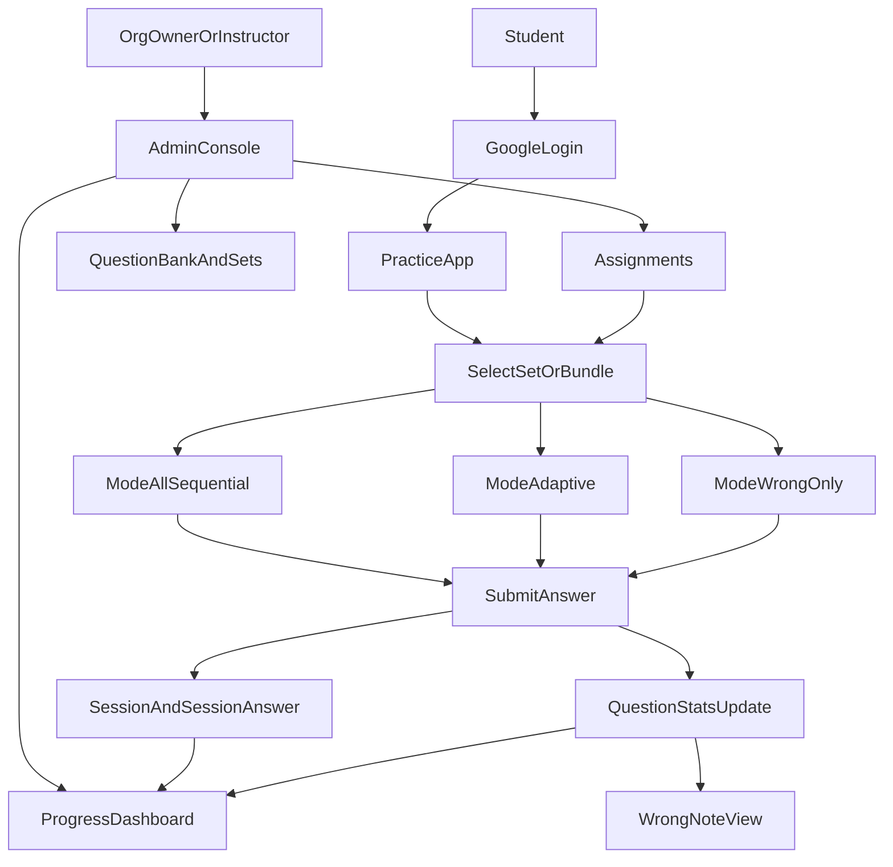

# 자격증 기출문제 연습 웹앱 기획/설계안

## 제품 목표
- 사용자가 **기출문제(세트)와 토픽 문제은행(랜덤)**을 섞어 학습하고, **문항별 시도/정오답 이력**을 기반으로 **오답노트 자동 생성 + 맞춤형 재출제**로 점수 향상을 돕는다.
- 운영 측면에서 **기관(테넌트) 단위**로 사용자/과제(문제세트) 배정과 현황 모니터링이 가능한 **관리자/강사 콘솔**을 제공한다.

## 핵심 사용자/권한(테넌트 기반)
- **테넌트(기관)**: 학원/학교/스터디 그룹 단위. 데이터/권한은 테넌트로 격리.
- **역할**
  - **OrgOwner(기관관리자)**: 테넌트 설정, 강사/사용자 관리, 과제 배정, 전체 통계
  - **Instructor(강사/운영자)**: 문제/세트 등록(권한 선택), 과제 배정/관리, 클래스 단위 통계
  - **Student(수강생)**: 문제 풀이, 오답노트, 개인 통계
  - (선택) **SystemAdmin**: SaaS 전체 운영(테넌트 관리)

## 로그인/계정
- **구글 로그인(OAuth)** 필수
- 최초 로그인 시 자동으로 **User 프로필 생성**
- **테넌트 소속 방식(권장)**: 초대 링크/초대 코드로 테넌트 가입 (도메인 자동 가입은 확장)

## 콘텐츠 구조(기출 세트 + 토픽 문제은행 혼합)
### 상위 개념
- **Exam(자격증/시험)**: 예) 정보처리기능사, AWS AIF-C01
- **ExamBlueprint(시험 설계/블루프린트)**: 시험 분류 체계(과목형/도메인형)
- **Section(출제 분류 1단계)**: 과목/도메인/영역(예: “1과목”, “Domain 1”)
- **Topic(출제 분류 2단계)**: 단원/세부 주제/TaskStatement
- (선택) **Tag**: 시험과 무관한 횡단 라벨(예: IAM, 네트워크)

### 기출 세트 축
- **PastPaper(기출 세트)**: 연도/회차/과목(또는 전과목) 단위
- **QuestionInPastPaper**: 기출 세트 내 문항 순서/번호

### 토픽 문제은행 축
- **QuestionInTopic**: 문제-Topic 연결(다대다)
- **QuestionInSection**: 문제-Section 연결(다대다, 토픽 없는 시험도 커버)

### 묶음
- **QuestionSet**: 사용자가 선택/배정받아 푸는 단위(기출 1개, 기출 묶음, 토픽 모음 등)
- **SetBundle**: 여러 `QuestionSet`을 묶어 한 번에 선택

### 예시(시험별 구조 샘플)
- **정보처리기능사(과목형)**
  - Section = 과목(예: 전자계산기일반, 패키지활용, …)
  - Topic = 단원/유형(예: 데이터베이스 기초, 스프레드시트 함수, …)
- **AWS AIF-C01(도메인형)**
  - Section = Domain(예: Domain 1, Domain 2, …)
  - Topic = TaskStatement/Objective(공식 블루프린트의 세부 항목)

### 운영/등록 흐름(관리자 관점)
- 새 `Exam` 생성 시 **블루프린트 템플릿**으로 Section/Topic 골격을 먼저 구성
  - 템플릿 예: “과목형(국가자격)”, “도메인형(AWS)”
  - 이후 문제 등록 시 Section/Topic을 선택(복수 선택 가능)

## 문항(문제) 데이터 모델(관리자 등록 요구사항 반영)
- **Question**
  - 본문 텍스트(다국어)
  - 문제 이미지(옵션)
  - 보기 4개(텍스트 다국어)
  - 보기 이미지(옵션: 보기별 0~4개)
  - 정답(1~4)
  - 해설 텍스트(다국어)
  - 해설 이미지(옵션)
  - 메타데이터: 난이도(선택), 출처/연도/회차(선택), 태그
- 이미지 업로드: 객체 스토리지(S3/GCS 등) + (선택) CDN

## 다국어(한글/영문) 지원
- 해외 시험(AWS 등)은 **한글·영문을 함께 저장**하고 학습 중 **표시 언어 전환/병기/번갈아 확인**을 지원
- 저장 모델(권장)
  - 텍스트 필드: `localized_text` 형태로 `ko`, `en` 저장(필요 시 확장)
  - 적용 범위: 문제 본문, 보기 4개, 해설
  - 기본 언어(primary_locale): `Exam` 또는 `QuestionSet` 단위로 지정
- 사용자 UX
  - 선호 언어(ko/en), “항상 병기”, “토글”, “번갈아 모드(문제마다 교대)” 옵션
  - 오답노트/복습에서도 동일하게 토글/병기 지원

## 학습 이력/오답노트(자동)
- 핵심은 **문항별 누적 통계** + **세션별 기록**을 함께 남기는 것
- **Session(풀이 세션)**: user_id, tenant_id, mode, 대상(QuestionSet/Bundle), 시작/종료, 타이머(옵션)
- **SessionAnswer(세션 답안)**: 선택답, 정오답, 풀이시간, 체크(북마크), 해설열람 여부
- **QuestionStats(누적; 사용자-문항)**: attempts, correct_count, wrong_count, last_seen_at 등
- **WrongNote(오답노트 뷰)**: wrong_count>0 또는 취약도 점수 상위 문항 필터로 자동 구성

## 오답 유형 분류
- 오답(또는 정답이지만 확신 없음)에 **오답 유형**을 남길 수 있게 함(선택 입력)
  - 예: 개념부족, 계산실수, 문제해석실수, 시간부족, 찍음, 헷갈림(유사개념), 단순암기미흡
  - 저장: `SessionAnswer.wrong_reason` + (선택) `confidence`
  - 활용: 오답노트 필터, 맞춤 출제 가중치

## 기억망각곡선 기반 복습 스케줄(단계형 간격 반복)
### 목표
- 오답/취약 문항을 “바로 다시”뿐 아니라 **시간 간격을 두고 반복**해 장기 기억으로 전환

### 데이터(권장 최소 스키마)
- **ReviewItem**(user_id + question_id)
  - `stage`: 0..N(복습 단계)
  - `due_at`: 다음 복습 예정 시각
  - `last_result`: correct/wrong
  - `last_answered_at`
  - `wrong_streak`(선택), `suspended`(선택)
- **SessionAnswer**
  - `wrong_reason`(선택)
  - `confidence`(선택: low/medium/high 또는 1~3)

### 기본 간격(디폴트)
- stage0: 10분
- stage1: 1일
- stage2: 3일
- stage3: 7일
- stage4: 14일
- stage5: 30일
- stage6+: 60일(또는 90일) 고정

### 업데이트 규칙(디폴트)
- **오답(wrong)**
  - 기본: `stage = max(0, stage - 1)` 후 `due_at = now + 10분`
  - `wrong_reason`가 **개념부족/헷갈림**이면: `stage = max(0, stage - 2)`
  - `wrong_reason`가 **시간부족/찍음**이면: stage 하락은 0~1로 완화하되 `due_at`은 짧게
- **정답(correct)**
  - 기본: `stage = min(stage + 1, stage_max)` 후 `due_at = now + interval(stage)`
  - `confidence`가 low이면 stage 상승을 보수적으로(+0)
- **첫 시도 문항**
  - 기관/사용자 옵션: “첫 정답도 stage0(10분) 재노출 1회” 토글

### 출제(문제 제시) 규칙
- **오늘 복습**: `due_at <= now` 문항 최우선(밀린 복습 우선)
- **맞춤형 문제 풀기**: due 우선 → 부족하면 취약도(priority: 오답유형/최근오답/낮은정답률)로 보충
- **오답노트**: “오답 목록” + “복습 큐(오늘/밀린)” 2탭 권장

## 풀이 모드
### 1) 순차 문제 풀기(전체)
- 선택한 `QuestionSet`(또는 Bundle)을 **고정 순서**로 제공

### 2) 맞춤형 문제 풀기
- `due` 문항(복습 큐) 우선 + 취약도 기반 보충

### 3) 오답 문제 풀기
- wrong_count>0 또는 최근 세션 오답만 모아 제공

## 시험 모드(실전 CBT)
- 타이머, 마킹/체크, 번호 패널, 미풀이/체크 필터, 제출 전 경고, 제출 후 채점/해설
- 문제 표시(1문항/스크롤), 글자 크기 등 UI 설정

### 보기(선택지) 랜덤 표시
- 보기 1~4의 **표시 순서를 세션마다 랜덤**으로 섞을 수 있게 함
- `SessionAnswer.choice_order`(표시 매핑)를 저장해 채점/리플레이 일관성 확보
- 다국어(ko/en)에서도 “정답 의미”가 유지되도록 보기 콘텐츠를 “보기 단위 객체”로 묶어 랜덤 처리

## 문제 세트 배정(관리자)
- **Assignment(과제)**: user 또는 group/class 대상, 세트/번들, 기간, 목표(문항수/회독/정답률) 설정
- Student는 “내 과제”에서 바로 시작

## 관리자/강사 콘솔
### 사용자/클래스 관리
- 사용자 초대(링크/코드), 역할 부여, 그룹/클래스 관리

### 문제 등록(단건)
- 문제/문제이미지(옵션), 보기 4개/보기이미지(옵션), 해설/해설이미지(옵션)
- 미리보기, 필수값 검증

### 콘텐츠 일괄 등록(CSV/엑셀 업로드)
- 템플릿 다운로드 → 업로드 → **검증 리포트(행 단위 성공/실패)** → 미리보기 → 확정 등록
- 다국어 칼럼 예: `question_text_ko`, `question_text_en`, `choice1_ko`, `choice1_en`, …, `explanation_ko`, `explanation_en`

### 검색/필터
- Exam/Section/Topic/Tag/난이도/출처(연도/회차)/QA상태/오답률, 텍스트 검색(본문/해설/태그)

### 품질 확인(검수) 워크플로
- 상태: `Draft` → `Review` → `Approved(Published)` (+ `Rejected`)
- 승인자/승인일 등 감사 필드 기록
- 기본 정책: 학습/과제 노출은 `Approved`만(기관 정책으로 완화 가능)

### 세트/번들/과제
- 기출 세트(연도/회차/과목 + 문항 순서), 토픽 세트(조건/랜덤 규칙), 번들 생성
- 사용자/클래스에 과제 배정(기간/완료 기준 포함)

### 현황 대시보드
- 테넌트/클래스/사용자별 과목(Section) 단위 풀이량/정답률/오답수, 과제 진행률, 최근 활동
- Drill-down: 특정 사용자 상세(Section/Topic/Set별 + 오답 상위)

## MVP 범위(권장)
- 구글 로그인 + 테넌트 가입(초대코드)
- 문항 CRUD + 이미지 업로드
- QuestionSet/Bundle 구성
- 풀이 모드(전체/맞춤/오답) + 시험 모드(CBT)
- 누적 통계 + 오답노트 + 복습 큐(오늘/밀린)
- 관리자: 사용자/클래스, 과제 배정, 기본 현황 대시보드
- **예시 데이터(시드) 제공**: 정보처리기능사 + AWS AIF-C01 골격 + 샘플 세트/번들/문항

## 예시 데이터(시드) 정책
- 시드에는 **자체 제작/더미 문항**을 우선 사용(저작권 리스크 회피)
- 실제 기출을 넣는 것은 기관(테넌트) 소유 데이터로 분리하거나 합법적 출처만 사용

## 이번 단계에서 제외
- 성능/비용/운영 최적화(CDN/캐시/대규모 동접 튜닝/저장소 비용 최적화 등)는 다음 단계에서 별도로 다룸

## 주요 데이터 흐름(요약)

